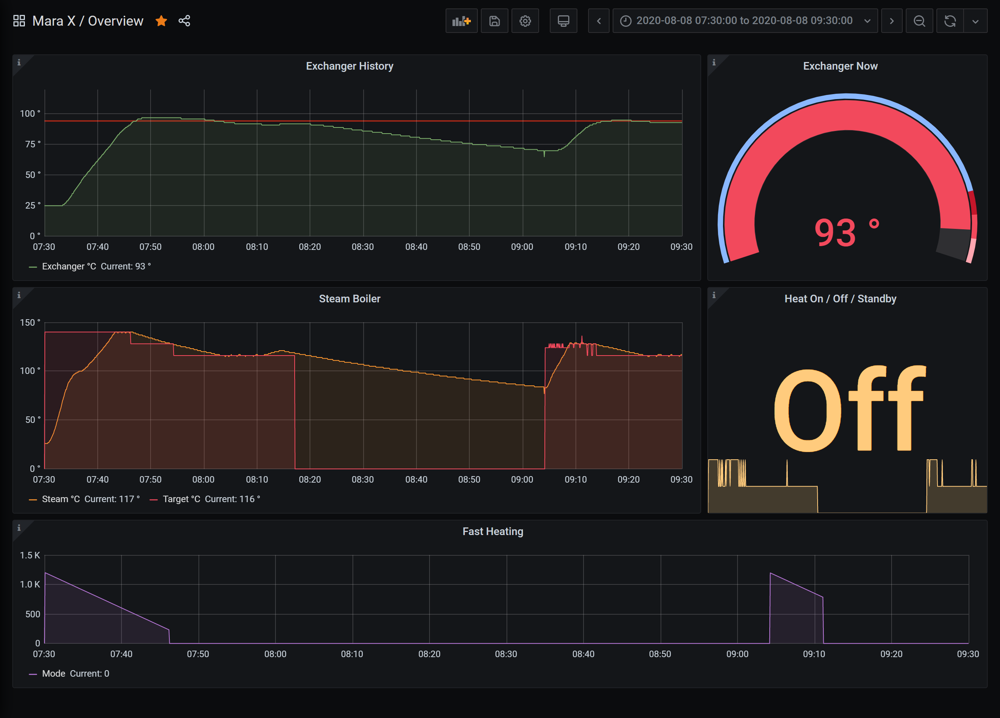

# Mara X Monitoring



Capture temperature data from a Lelit Mara X espresso machine via a serial connection and persist in a database and expose via grafana.

Docker will persist DB storage using volumes so restarts won't cause data loss.

Tested on a Raspberry Pi.

All credit to the author of this [post](https://www.reddit.com/r/espresso/comments/hft5zv/data_visualisation_lelit_marax_mod/) for doing so much of the ground work!

## How to run

Run grafana / influxDB / ingestion via docker-compose with the following

```shell
[sudo] docker-compose up --build
```

This can now be backgrounded.

## What do I need?

- Lelit Mara X PL62 espresso machine ([link](https://marax.lelit.com/index-eng.html))
- Serial to USB cable ([link](https://www.amazon.co.uk/gp/product/B01N4X3BJB/ref=ppx_yo_dt_b_asin_title_o06_s00?ie=UTF8&psc=1))
- Computer capable of running linux / docker, like a raspberry pi ([link](https://www.raspberrypi.org/products/raspberry-pi-4-model-b/))

## Other

- Mara X logs cleared daily
- Influx DB retention policy set to 2 weeks, see [here](./config/influxdb/influxdb-init.iql)
